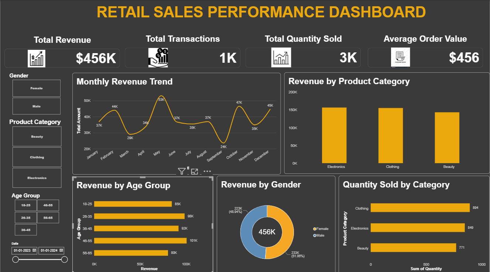

# 📊 CodSoft Retail Sales Analysis

## 📖 Project Overview

**CodSoft Retail Sales Analysis** is an end-to-end Data Analytics project completed as part of the **CodSoft Data Analytics Internship**.

The project focuses on transforming raw retail sales data into meaningful insights through **Data Cleaning, Exploratory Data Analysis, Data Visualization, and Interactive Power BI Dashboard Development**.

The analysis explores sales performance, product categories, customer demographics, revenue trends, transaction patterns, and quantity sold.

The project demonstrates a complete analytics workflow from raw data preparation to business-oriented visualization and dashboard reporting.

---

# 🎯 Project Objectives

✔ Clean and prepare the raw retail sales dataset

✔ Perform Exploratory Data Analysis (EDA)

✔ Analyze revenue and sales performance

✔ Understand product category performance

✔ Analyze customer demographics

✔ Identify sales trends and patterns

✔ Create meaningful data visualizations

✔ Build an interactive Power BI dashboard

✔ Present important business insights through data

---

# 📊 Dataset Information

| Attribute  | Details                                      |
| ---------- | -------------------------------------------- |
| Dataset    | Retail Sales Dataset                         |
| Domain     | Retail & Sales Analytics                     |
| Data Type  | Transactional Sales Data                     |
| Analysis   | Sales, Revenue, Quantity & Customer Analysis |
| Tools Used | Python & Power BI                            |

The dataset contains retail transaction information that can be used to analyze sales performance, customer characteristics, product categories, and revenue patterns.

---

# 🛠️ Tech Stack

| Category                | Technologies              |
| ----------------------- | ------------------------- |
| Programming             | Python                    |
| Data Manipulation       | Pandas, NumPy             |
| Visualization           | Matplotlib, Seaborn       |
| Business Intelligence   | Power BI                  |
| Data Analysis           | Exploratory Data Analysis |
| Dashboard Measures      | DAX                       |
| Development Environment | Visual Studio Code        |
| Version Control         | Git & GitHub              |

---

# 🔄 Project Workflow

```text
Raw Retail Sales Dataset
          │
          ▼
     Data Cleaning
       (Python)
          │
          ▼
    Cleaned Dataset
          │
          ▼
Exploratory Data Analysis
          │
          ▼
 Data Visualization
          │
          ▼
  Power BI Data Analysis
          │
          ▼
 Interactive Dashboard
          │
          ▼
   Business Insights
```

---

# 🧹 Task 1 – Data Cleaning

## 🎯 Objective

The objective of Task 1 was to clean and prepare the raw retail sales dataset for further analysis.

## 🔍 Work Performed

* Loaded the raw dataset using Pandas
* Examined dataset structure
* Checked rows and columns
* Checked for missing values
* Checked for duplicate records
* Reviewed column data types
* Corrected data types where required
* Cleaned and prepared the dataset
* Created a cleaned dataset for further analysis

## 🛠️ Tools Used

* Python
* Pandas
* NumPy

## 📂 Files

```text
TASK_1_DATA_CLEANING/
│
├── dataset/
│   ├── retail_sales_dataset.csv
│   └── cleaned_retail_sales_dataset.csv
│
└── task1_cleaning.py
```

---

# 🔍 Task 2 – Exploratory Data Analysis

## 🎯 Objective

The objective of Task 2 was to explore the cleaned retail sales dataset and identify important patterns, relationships, and trends.

## 📊 Analysis Performed

* Descriptive statistics
* Revenue analysis
* Transaction analysis
* Quantity sold analysis
* Product category analysis
* Gender-based analysis
* Age-based analysis
* Age group analysis
* Correlation analysis
* Quantity vs Total Amount analysis
* Category and gender comparison

## 📈 Visualizations Created

* Revenue by Product Category
* Transactions by Product Category
* Revenue by Gender
* Revenue by Age Group
* Quantity vs Total Amount
* Category vs Gender Revenue
* Correlation Heatmap
* Additional exploratory charts

## 📂 Files

```text
TASK_2_EDA/
│
├── charts/
├── eda_analysis.py
├── EDA_Report.txt
└── visualizations.py
```

---

# 📊 Task 3 – Data Visualization & Power BI Dashboard

## 🎯 Objective

The objective of Task 3 was to create meaningful data visualizations and develop an interactive Power BI dashboard for retail sales performance analysis.

## 🐍 Python Visualization

Python was used to create additional visualizations using:

* Pandas
* Matplotlib
* Seaborn

These visualizations were used to communicate sales trends, category performance, customer demographics, and relationships between variables.

---

# 📈 Power BI Dashboard

An interactive **Retail Sales Performance Dashboard** was developed using Microsoft Power BI.

The dashboard provides a summarized view of retail sales performance using KPIs, charts, and interactive filters.

---

# 💳 Key Performance Indicators

The dashboard includes:

* 💰 **Total Revenue**
* 🧾 **Total Transactions**
* 📦 **Total Quantity Sold**
* 💵 **Average Order Value**

---

# 📊 Dashboard Visualizations

### 📈 Monthly Revenue Trend

Shows how revenue changes over time and helps identify monthly sales patterns.

### 🛍️ Revenue by Product Category

Shows the revenue contribution of different product categories.

### 👥 Revenue by Age Group

Shows revenue distribution across different customer age groups.

### 👤 Revenue by Gender

Provides a comparison of revenue generated across genders.

### 📦 Quantity Sold by Product Category

Shows the quantity of products sold across different categories.

---

# 🎛️ Interactive Filters

The dashboard includes interactive slicers for:

* Gender
* Product Category
* Age Group
* Date

These filters allow users to analyze specific customer and sales segments.

---

# 🧮 Power BI Features

* DAX Measures
* Calculated Columns
* KPI Cards
* Slicers
* Bar Charts
* Line Chart
* Donut Chart
* Interactive Filtering
* Dashboard Formatting

An **Age Group** calculated column was also created to support customer demographic analysis.

---

# 📷 Dashboard Preview



---

# 📌 Business Questions Answered

The project helps answer questions such as:

* What is the overall revenue generated?
* How many transactions were recorded?
* How many products were sold?
* What is the average order value?
* How does revenue change over time?
* Which product categories contribute to revenue?
* How does revenue vary across genders?
* Which age groups contribute to sales?
* Which product categories have higher quantities sold?
* What relationships exist between important sales variables?

---

# 💡 Key Insights

The analysis provides insights into:

* Overall retail sales performance
* Revenue trends over time
* Product category contribution
* Customer demographic patterns
* Gender-wise revenue distribution
* Age-group revenue distribution
* Quantity sold across product categories
* Relationships between sales variables

> **Note:** Specific numerical findings can be added here after reviewing the final EDA results and dashboard values.

---

# 📊 Dashboard Features

### 💰 Sales Performance

* Total Revenue
* Total Transactions
* Total Quantity Sold
* Average Order Value

### 🛍️ Product Analysis

* Revenue by Product Category
* Quantity Sold by Product Category

### 👥 Customer Analysis

* Revenue by Gender
* Revenue by Age Group

### 📅 Time Analysis

* Monthly Revenue Trend
* Date-based filtering

---

# 📂 Repository Structure

```text
Codsoft_Retail_Sales_Analysis/
│
├── TASK_1_DATA_CLEANING/
│   ├── dataset/
│   │   ├── retail_sales_dataset.csv
│   │   └── cleaned_retail_sales_dataset.csv
│   └── task1_cleaning.py
│
├── TASK_2_EDA/
│   ├── charts/
│   ├── eda_analysis.py
│   ├── EDA_Report.txt
│   └── visualizations.py
│
└── TASK_3_DATA_VISUALIZATION/
    ├── charts/
    ├── Retail_sales_dashboard.pbix
    ├── Retail_sales_dashboard_screenshot.png
    └── visualizations.py
```

---

# 📚 Skills Demonstrated

* Data Cleaning
* Data Preprocessing
* Exploratory Data Analysis
* Statistical Analysis
* Data Visualization
* Python Programming
* Pandas
* NumPy
* Matplotlib
* Seaborn
* Power BI
* DAX
* Dashboard Development
* Data Storytelling
* Business Intelligence
* Git & GitHub

---

# 🔮 Future Enhancements

The project can be further enhanced by:

* Adding sales forecasting using Machine Learning
* Performing customer segmentation using clustering
* Adding profit and profit-margin analysis
* Adding advanced Power BI drill-through pages
* Adding more detailed customer behavior analysis
* Integrating regularly updated sales data
* Developing predictive insights for product demand

---

# 📜 Internship Outcome

This project provided practical experience in the complete Data Analytics workflow, starting from raw data cleaning and exploratory analysis to visualization and interactive dashboard development.

Through the internship project, I gained hands-on experience in:

✔ Python-based data analysis

✔ Data cleaning and preprocessing

✔ Exploratory Data Analysis

✔ Data visualization

✔ Power BI dashboard development

✔ DAX measures and calculated columns

✔ Business-oriented data storytelling

✔ GitHub project documentation

---

# 🎓 Internship Information

**Program:** CodSoft Data Analytics Internship

**Project:** Retail Sales Analysis

**Domain:** Data Analytics

**Tasks Completed:**

* ✅ Task 1 – Data Cleaning
* ✅ Task 2 – Exploratory Data Analysis
* ✅ Task 3 – Data Visualization & Power BI Dashboard

---

# 👩‍💻 Author

## Mamta Choudhary

**BSc Data Science & Artificial Intelligence**
Interested in Data Analytics, Business Intelligence, Machine Learning, and Data Science.

Connect with me
📧 Email: choudharymamta1003@gmail.com

💼 LinkedIn: https://www.linkedin.com/in/mamta-chaudhary-964128353/

---

# ⭐ Acknowledgement

This project was completed as part of the **CodSoft Data Analytics Internship**.

The internship provided an opportunity to apply data analytics concepts to a real-world-style retail sales dataset and develop practical skills in Python, Exploratory Data Analysis, visualization, and Power BI.

---

⭐ **If you found this project useful, feel free to explore the repository and give it a star!**
